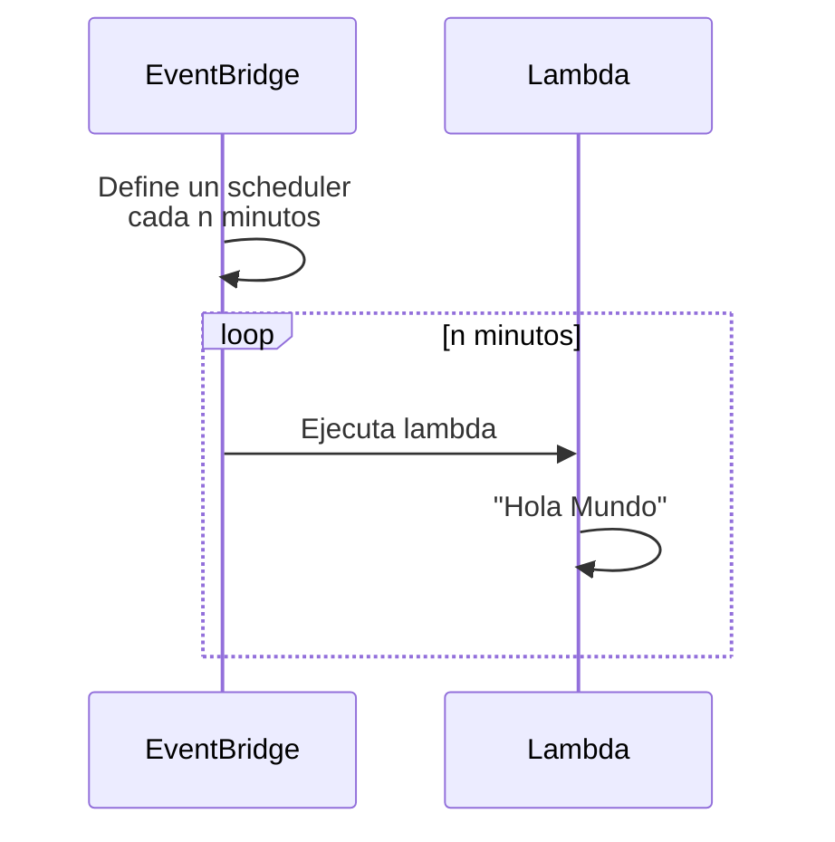

# EB_CRON-LAMBDA
Crea la infraestructura básica en terraform conforme al siguiente diseño


Consideración: A fin de generar el archivo zip necesario para subir la lambda con terraform, ejecuta el siguiente comando:
```shell
zip -r ./schedule-lambda-python.zip lambda_function.py
```

También es necesario contar con un archivo llamado terraform.tfvars. El contenido del mismo puede ser:
```tex
aws_region              = "us-east-2"
sso_shared_config_files = ["/Users/jach/.aws/config"]
sso_profile             = "Administrator_Access_SSO-123456789012"
```shell
